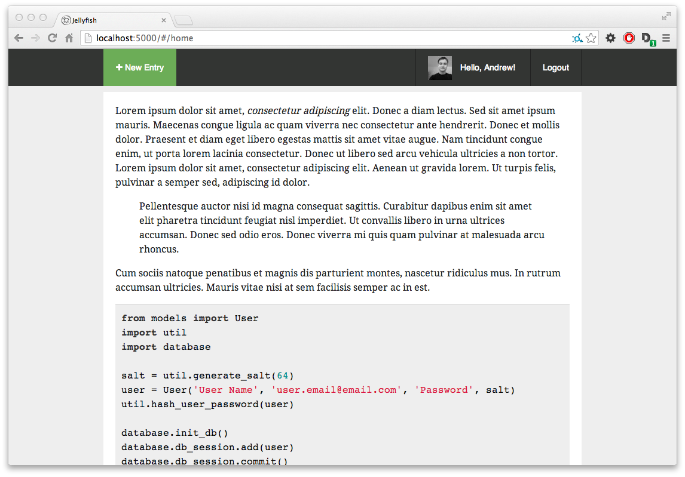

# jellyfish

Stream of consciousness writing repository. The point of jellyfish is to make the writing and maintaining of markdown notes and essays painless. Less clutter and thought concerning the medium, more thought about the writing.

Since jellyfish is meant to be used as a utility for maintaining notes and not the public frontend of the notes themselves, a robust API for accessing public entries is planned. The `sample-client/` directory contains a minimal example of a client that utilizes the feed API.



## Running jellyfish

*As a note, the following process will eventually be made easier and more automated.*

To run jellyfish you'll need to create a new file called `config.py` that contains two keys: a `secret_key` used for maintaining secure sessions and a `hash_key` used as an extra salt when hashing passwords (used along with the user-specific salts).

You'll also need to instantiate a database, and create an initial user. (There's currently no user-friendly way of creating users or signing up.)  Your bootstrapping function could look something like this:

```python
from models import User
import util
import database

salt = util.generate_salt(64)
user = User('User Name', 'user.email@email.com', 'Password', salt)
util.hash_user_password(user)

database.init_db()
database.db_session.add(user)
database.db_session.commit()
User.query.all()
```

After that, you should be able to run `main.py` and be on your way!

## Thoughts, Motivations, FAQ

+ Jellyfish is intentionally feature-minimal and ridiculously basic. For now each entry has exactly two fields: an owner and a blob of content. 
+ *Isn't this just blogging software?* Kind of, but not really. Blogging has certain objectives: to reach an audience and make it easy for the readers to interact with the writers. I want to build something a little different: a container for thoughts that may or may not be revisited later (that would be forgotton otherwise). The API certainly could allow you to build a blog off of it, but I wouldn't suggest it. For blogging, I'd suggest something more robust and feature-rich, like [Ghost](https://github.com/TryGhost/Ghost).

## Dependencies
+ Flask (0.10.1)
+ SQLAlchemy (0.9.1)
+ Angular.js (1.0.7)

## License

MIT License

